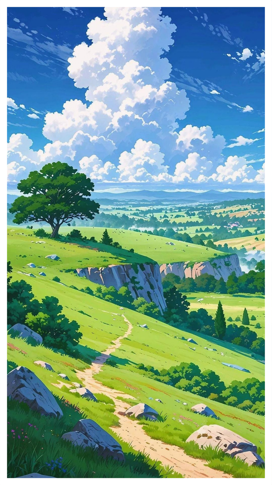
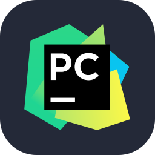

<h1 align="center" style="margin-bottom: -45px;">Hello, I'm Andrew Yakimtsev!</h1>

  
<pre>
    💼 IT Technician with 2+ years supporting systems & troubleshooting 
    💻 Experienced with Python, PowerShell, and C++  
    ⚙️ Building tools like data scrapers and desktop applications  
    🎮 Work • Code • Anime • Art • Game
    🎓 Pursuing a Bachelor’s in Computer Science (WGU) - Expected Graduation 2027
</pre>
<pre>
    Work         8 hrs 30 mins        ██████████████████ ──────   39.53 %
    Code         5 hrs                ███████████ ─────────────   23.26 %
    Anime        3 hrs                ███████ ─────────────────   13.95 %
    Art          3 hrs                ███████ ─────────────────   13.95 %
    Game         2 hrs                ████ ────────────────────   09.30 %
</pre>

  
  
  

 

### 🛠️ Languages and Tools:

  

### 📊 GitHub Stats

  

